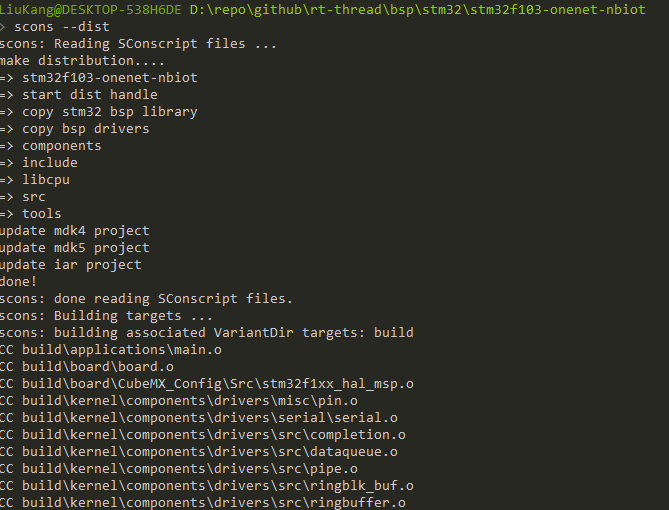
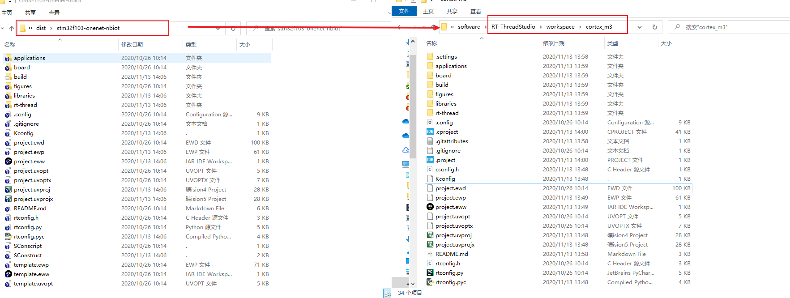
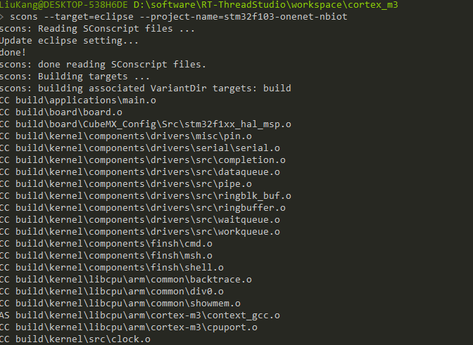

# 制作 RT-Thread Studio 工程

本文档旨在帮助用户快速地建立 RT-Thread Studio 工程，模板支持包提供了 M0, M3, M4, M7 的 make 工程， 以及 M0 的 Scons 工程模板。本文将以 cortex-m0 模板工程为例，讲解如何将用户的开发板支持包添加到 RT-Thread Studio。

## 制作 BSP 支持包

制作 bsp 的方法这里就不在介绍，请参考文档 《开发板支持包设计规范》和 《开发板支持包制作向导》两个文档。

## 添加模板代码到工程

1. 创建模板工程：

   
2. 添加实际开发板使用的代码，这里以 STM32CubeMX 为例，生成一个 stm32f030-nucleo 的 MDK工程；

   

3. 复制 CubeMX 生成的工程目录下所有文件到 RT Studio 创建的工程目录下；

4. 代码添加完成后，此时直接编译是无法通过的，需要修改一些配置，下面的步骤将演示如何修改配置保证工程可以编译下载。

   

## 忽略文件

1. 工程中可能会包含有一些不需要的文件，我们需要手动忽略掉这些文件。以本次演示的工程为例：

   

2. 可以看到，在 Drivers 文件目录下包含了许多暂不需要的文件，鼠标右键点击需要忽略掉的文件，选择 Resoure Configurations -> Exclude from Build：

   

3. 点击 Debug 前面的方框，点击 OK：

   

4. 此时工程中就看不到该文件，可以看到 RTOS 文件消失了：

   

5. 根据以上步骤，屏蔽掉工程不需要的文件。

## 添加头文件路径

1. 在项目资源管理器，右键点击工程，选择属性；

2. 添加头文件路径:

   

3. 如果头文件路径有误，会看一个黄色的感叹号，此时就要检查一下头文件的路径了：

   

## 更改硬件参数

1. 在项目资源管理器，右键点击工程，选择属性；

2. 修改硬件参数；

   

## 添加宏定义

1. 在项目资源管理器，右键点击工程，选择属性；

2. 添加宏定义；

   

## 添加链接库

1. 在项目资源管理器，右键点击工程，选择属性；

2. 添加链接库，添加一个 C 库为例；

   

## 修改链接脚本

模板工程提供了默认的 eclipse 链接脚本文件，修改链接脚本路径：

   

## 编译工程

以上步骤完成后，编译工程：

   

如果编译产生错误，请根据错误提示进行修改。

## 提交 BSP 支持包

1. 清除编译产物，打开工程所在文件：
2. 参考文档 《开发板支持包设计规范》和 《开发板支持包制作向导》两个文档创建开发板支持包。
3. 编译下载验证完毕后，向 RT-Thread 提交 BSP 支持包。 

# 从现有 RT-Thread BSP 制作 Studio 工程

以 `rt-thread\bsp\stm32\stm32f103-onenet-nbiot` bsp 工程为例。

1. 使用 Studio 创建一个 m3 的模板工程；

2. 在 `rt-thread\bsp\stm32\stm32f103-onenet-nbiot` 目录下使用 env 工具执行命令 `scons --dist` 进行打包：

   

3. 复制 dist 文件夹工程内所有文件到模板工程目录下，相同文件直接替换，模板工程目录下的多余文件直接删除掉：

   

4. 在模板工程下使用 env 工具执行命令 `scons --target=eclipse --project-name=stm32f103-onenet-nbiot`：

   

5. 在 Studio 中编译模板工程，编译成功后清除编译产物，然后提交 BSP 支持包。